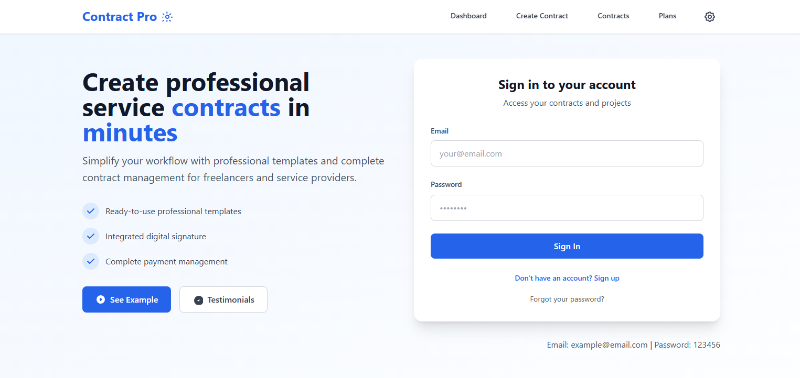

# Contract Pro - use os dados abaixo para teste

Email: example@email.com
Password: 123456

## 🖼️ Preview

 <!-- Adicione um screenshot do app, se quiser -->

## 🛠️ Tecnologias

- [React](https://react.dev/)
- [Vite](https://vitejs.dev/)
- [TypeScript](https://www.typescriptlang.org/)
- [Supabase](https://supabase.com/)
- [@react-pdf/renderer](https://react-pdf.org/)
- [Tailwind CSS](https://tailwindcss.com/)
- [n8n](https://n8n.io/) (para automação de envio de e-mails)

## 📦 Instalação local

```bash
git clone https://github.com/SEU_USUARIO/contract-pro.git
cd contract-pro
npm install
npm run dev
```

Acesse [http://localhost:5173](http://localhost:5173) no navegador.

## 🌐 Deploy no GitHub Pages

1. Instale o pacote de deploy:
   ```bash
   npm install --save-dev gh-pages
   ```
2. Adicione ao seu `package.json`:
   ```json
   "homepage": "https://SEU_USUARIO.github.io/contract-pro",
   "scripts": {
     "predeploy": "npm run build",
     "deploy": "gh-pages -d dist"
   }
   ```
3. Faça o build e deploy:
   ```bash
   npm run deploy
   ```
4. O app estará disponível em:  
   `https://SEU_USUARIO.github.io/contract-pro`

## 📄 Licença

Este projeto é open source, sinta-se à vontade para usar e contribuir!

---
